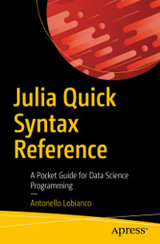

# Apress Source Code

This repository accompanies [*Julia Quick Syntax Reference*](https://www.apress.com/9781484251898) by Antonello Lobianco (Apress, 2019).

[comment]: #cover

Download the files as a zip using the green button, or clone the repository to your machine using Git.

## How to run the code

To run the code in the book as last updated (to work with latest versions - as of today - of the various packages) perform the following passages:

- Clone the repo...

  `git clone https://github.com/Apress/julia-quick-syntax-reference.git`
- Enter the cloned directory...

  `cd julia-quick-syntax-reference`  

- Start Julia:

  `julia`

  Notes:
    - package `Cxx` doesn't work with Julia versions > 1.3 (at time of writing)

- Enter the package mode..

  `]`
- "Activate" the current folder...

  `activate .`
- "Instantiate" the repository with the packages described in Manifest.toml...

  `instantiate`
- A few packages would still need to be build on the first usage, for example GLPK:

  `] build GLPK`

## Releases

Release v1.0 corresponds to the code in the published book, without corrections or updates.

## Contributions

See the file Contributing.md for more information on how you can contribute to this repository.
